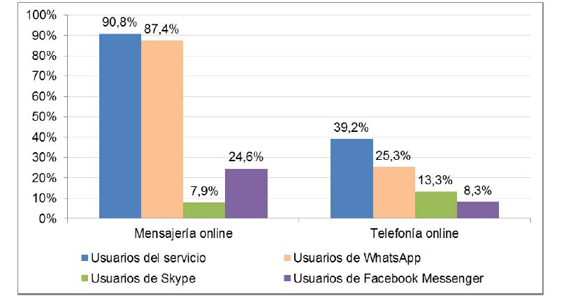

# Chatbots

Durante el transcurso de 2016 se realizó un estudio sobre el uso de los distintos medios de comunicación en el que se reflejaba que la mensajería instantánea ganaba la batalla a otros servicios de comunicaciones tradicionales hasta la fecha. 

La <a href="https://es.wikipedia.org/wiki/Comisi%C3%B3n_Nacional_de_los_Mercados_y_la_Competencia">CNMC</a> (Comisión Nacional de los Mercados y la Competencia) difundió un <a href="http://data.cnmc.es/datagraph/files/Informe%20Telecos%20y%20Audiovisual%202016.pdf">estudio</a> en el que aseguraba que los mensajes tradicionales (SMS) y las llamadas telefónicas habían quedado relegados a un segundo plano. En este informe reflejaban que dos de cada diez españoles nunca realizan llamadas desde teléfonos fijos y cuatro de cada diez llaman menos de una vez por semana.

En contraposición, las aplicaciones de mensajera instantánea son en la actualidad el medio de comunicación más empleado. De este modo aplicaciones como Telegram, Messenger o Whatsapp lo utilizan el 60% de los españoles.

## Índice
  1. **[historia](#historia)**
  2. **[descripción](#descripción)**
  3. **[estado del arte](#estado-del-arte)**
  4. **[modelo conceptual](#modelo-conceptual)**
  5. **[comparativa de productos](#comparativa-de-productos)**
  6. **[casos de uso](#casos-de-uso)**
  7. **[principios basicos de diseño](#principios-basicos-de-diseño)**
  8. **[consejos y recomendaciones](#consejos-y-recomendaciones)**
  9. **[referencias](#referencias)**

## historia

### La Máquina de Turing (1950) 

Entre 1950 y 1960, Alan Turing y Joseph Weizenbaum contemplaron la posibilidad de que los ordenadores se comunicasen como humanos mediante experimentos como el test de Turing y que fue el inicio del concepto de los Chatbots.

El test de Turing se desarrollo por Alan Turing en 1950 para verificar la habilidad de un ordenador de mostrar un comportamiento inteligente equivalente al realizado por un humano.

### ELIZA La Terapeuta (1966)

ELIZA fue el primer chatbot construido. Inventado en 1966 por Joseph Weizenbaum en el MIT que con apenas 200 líneas de código permitió imitar el lenguaje de una terapeuta.

El funcionamiento de ELIZA se basaba en la búsqueda de palabras clave en las frases introducidas por el usuario respondiendo con frases previamente entrenadas en su base de conocimiento. Tras utilizar el bot, acababa volviéndose intuitivo y repetitivo, convirtiendo las conversaciones con sus usuarios incoherentes.

### PARRY El Paranoico (1972)

En los 70s, ELIZA conoció a su primer paciente no humano: PARRY, un chatbot que imitaba a una persona con esquizofrenia y paranoia.

### PARRY met ELIZA (1973)

### DR. SBAITSO (1992)

Un programa de síntesis del habla creado por computadoras basadas en MS DOS. Fue diseñado para mostrar una voz digitalizada, el Doc estaba lejos de asumir un rol de de psicólogo interactuando con usuarios humanos.

### A.L.I.C.E (2000)

“Artificial Linguistic Internet Computer Entity” era un bot con procesamiento natural del lenguaje (PNL). Podía aplicar patrones heurísticos uniendo reglas de lo que los humanos le decían, es decir, tenía una conversación.

### EUGENE (2001)

Un bot inteligente distribuido en redes SMS. Con características como acceso veloz a la data y personalizaciones conversacionales, era considerado el precursor de SIRI y Samsung’s Voice.

### SIRI Apple (2010)

Un asistente inteligente virtual, parte del sistema operativo iOS de Apple, el cual tiene características como interfaz natural del lenguaje, preguntas y respuestas, y puede generar solicitudes al Internet.

### IBM Watson (2011)

Watson fue diseñado para competir en Jeopardy!, el cual lo gano en el 2011 ante dos de los más grandes campeones del juego. Ahora Watson ocupa procesamiento natural del lenguaje (PNL) y Machine Learning para revelar características de grandes cantidades de datos.

### Google NOW - Google HOME (2012)

Desarrollado por Google para la aplicación móvil Google Search, empleando una interfaz de usuario natural del lenguaje para responder preguntas, hacer recomendaciones, y realizar acciones como delegar una solicitud a una serie de servicios web.

### Amazon ALLO - Amazon ALEXA (2015) 

Un servicio de voz habitado en el dispositivo de Amazon, Echo. Alexa es capaz de interactuar por medio de la voz, utiliza procesamiento natural del lenguaje para recibir, reconocer y responder comandos de voz.

### CORTANA - Microsoft (2015)

Un asistente inteligente personal desarrollado por Microsoft, Cortana te envía recordatorios, reconoce comandos naturales de voz, y responde preguntas usando el motor de búsquedas de Bing.

### TAY.ai - Microsoft (2016)

Diseñado para simular el habla y los hábitos de una joven americana. Tay rápidamente desarrollo paranoia viciosa y tubo que ser apagado a tan solo 6 horas dado que empezó a dar comentarios ofensivos a la gente.

### Bots For Messenger - Facebook (2016)

En Abril, Facebook lanzo una plataforma que permite a los desarrolladores crear bots que pueden interactuar con los usuarios de FB. Hasta Junio, 11.000 bots estaban disponibles.

### VIV (2017)

### BIXBY - Samsung (2017)

**[Ir al índice](#Índice)**

## estado del arte

**[Ir al índice](#Índice)**

## modelo conceptual

**[Ir al índice](#Índice)**

## comparativa de productos

**[Ir al índice](#Índice)**

## casos de uso

**[Ir al índice](#Índice)**

## principios basicos de diseño

### Mensaje de bienvenida y error

Configurar un mensaje de bienvenida que defina la funcionalidad del bot y aporte información sobre sus posibilidades. 

Adicionalmente será necesario controlar los mensajes no reconocidos.

### Definir su personalidad

Definir la personalidad del bot ayudará a sus usuarios a establecer vínculos emocionales con el bot.

### Listar sus funcionalidades y capacidades

Facilitar de una forma clara y concisa el listado de funcionalidades que el bot pone al alcance de los usuarios.

### Flujos de conversación

Acotar y definir flujos de conversación que los usuarios podrán seguir durante la interacción con el bot.

**[Ir al índice](#Índice)**

## consejos y recomendaciones

### Errores

Se producirán errores constantemente a lo largo de toda la conversación. Será necesario personalizar los mensajes de error según el usuario y el contexto.

### Visibilidad

Mantener informado al usuario en todo momento de en qué punto de la conversación se encuentra.

### Diversidad de usuarios

Los usuarios experimentados y con conocimientos previos del sistema emplearán atajos en las conversaciones, por ejemplo, informando de los parámetros obligatorios de una acción sin necesidad de solicitarlos.

### Testing

Mantener un control de los distintos flujos de conversación existentes y sistemas que permitan realizar el testeo automático del bot.

**[Ir al índice](#Índice)**

## Referencias

* [Chatbots Magazine](https://chatbotsmagazine.com/)
* [Introducing the Bots Landscape](http://venturebeat.com/2016/08/11/introducing-the-bots-landscape-170-companies-4-billion-in-funding-thousands-of-bots/)
* [MyClever - ChatBots A Consumer Research Study](http://www.mycleveragency.com/media/download/0c44f0c083879818a0d2347ab948752b)
* [Microsoft Channel Inspector](https://docs.botframework.com/en-us/channel-inspector/channels/Telegram)
* [12+ Frameworks to Build ChatOps Bots](http://nordicapis.com/12-frameworks-to-build-chatops-bots/)
* [Así era ELIZA, el primer bot conversacional de la historia](https://www.xataka.com/historia-tecnologica/asi-era-eliza-el-primer-bot-conversacional-de-la-historia)
* [How to build yout own AI Assistant Using API.ai](https://www.sitepoint.com/how-to-build-your-own-ai-assistant-using-api-ai)
* [Gartner's 2016 Hype Cycle for Emerging Technologies](http://www.gartner.com/newsroom/id/3412017)
* [Home Automation devices](https://www.youtube.com/channel/UCXn_loz0TlUKarhS6sUoKVw)
* [War of Bot Platforms](https://chatbotbook.com/war-of-bot-platforms-22e02cfa0a99?gi=cfba6c7b93c1#.q8s3487ay)

**[Ir al índice](#Índice)**

